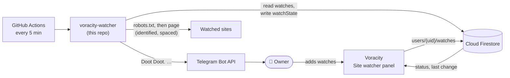

# voracity-watcher

The scheduled runner behind [Voracity](https://voracity.web.app)'s **Site watcher**.
Every five minutes, GitHub Actions checks the pages you have listed in Voracity.
When something changes, Ica, a Telegram bot, sends you a message:

```text
Doot Doot.
EX13 singles changed: 12 new, 2 changed.

New
• EX13-001 … 980 円 在庫 : 3 点
…
Changed
• EX13-005 … 880 円
   was: EX13-005 … 980 円

Open the page
```

The watch list lives in your private Firestore account, not in this repository.
This repository holds only generic code, so it can be public. That gives free,
unlimited Actions minutes, and no addresses or personal data are published.



## Being a good citizen

The runner is built so sites have no reason to block it:

- **robots.txt is always obeyed.** Before checking a page, the runner fetches the site's
  `robots.txt` once per run and follows it under [RFC 9309](https://www.rfc-editor.org/rfc/rfc9309):
  - Rules for the `VoracityWatcher` user agent take precedence over the `*` rules.
  - The longest matching rule wins.
  - If robots.txt returns a server error or can't be reached, nothing on that site is
    fetched until it can be read again.
- **Crawl-delay is respected.** Requests to one host go one at a time, at least 3 seconds
  apart, or the site's `Crawl-delay` if that's longer. A slow host gets fewer checks per
  run; the rest wait for the next run.
- **Honest identification.** Every request sends
  `User-Agent: VoracityWatcher/1.0.0 (+https://github.com/kevanwee/voracity-watcher)`, so
  site operators can see who is visiting and why.
- **Minimal requests.** One request fetches the page's HTML only: no images, scripts or
  stylesheets, and no cookies. Pages that send `ETag` or `Last-Modified` are re-requested
  conditionally, so an unchanged page costs almost nothing.
- **Backing off.** A `429` or `503` honours `Retry-After`. Other failures back off
  exponentially from the watch's interval, up to once a day. A `401`/`403` (refused)
  pauses checks and tells you, without hammering the site.
- **Bounded work.** At most 30 watches per owner, 5 per host per run, and a 4-minute run
  budget. Pages over 5 MB and requests over 20 seconds are abandoned.

Check each site's terms yourself as well. robots.txt says what automated access a site
allows; its terms may add more. Alerts are for your own use: don't republish content
you're notified about.

## What is compared

- **With a CSS selector** (for example `.card-product`), each matching element becomes
  one item. Buttons and form controls inside it are ignored. Items are compared as a set,
  and an item whose leading code (such as `BT26-050`) appears on both sides with
  different text is reported as *changed*.
- **Without a selector**, each visible line of the page's text is an item.
- **Ignore pattern** (optional): a regular expression removed from each item before
  comparing. For example, `在庫\s*:\s*\d+\s*点` stops stock counts from triggering alerts.

The first check, or the first check after you change a watch's address, selector or
ignore pattern, records a baseline and confirms it on Telegram. Sites that require a login
or build their content with JavaScript can't be watched.

## Setup

You need a Voracity notes account, a Telegram account, and access to the Voracity
Firebase project.

1. **Create Ica.** In Telegram, message [@BotFather](https://t.me/BotFather):
   - Send `/newbot`, set the name to `Ica`, and choose a username ending in `bot`.
     Keep the token private.
   - Send `/setuserpic` and upload Ica's picture.
   - Optionally, `/setdescription`.
2. **Find your chat ID.** Send Ica any message, then open
   `https://api.telegram.org/bot<token>/getUpdates` in your browser and copy
   `result[0].message.chat.id`.
3. **Create a least-privilege service account.** In Google Cloud console → IAM & Admin →
   Service accounts, for the Firebase project:
   - Create `voracity-watcher` with only the **Cloud Datastore User** role.
   - Under Keys, add a JSON key and download it.
4. **Add repository secrets** (Settings → Secrets and variables → Actions):

   | Secret | Value |
   | --- | --- |
   | `TELEGRAM_BOT_TOKEN` | The token from BotFather |
   | `FIREBASE_SERVICE_ACCOUNT` | The whole JSON key file |
   | `WATCHER_OWNERS` | `{"<notes account UID>": "<chat ID>"}`. Voracity's Site watcher setup shows this with your UID filled in |

   With the GitHub CLI, set them from files so they never appear in your shell history:

   ```bash
   gh secret set TELEGRAM_BOT_TOKEN   < token.txt
   gh secret set FIREBASE_SERVICE_ACCOUNT < service-account.json
   gh secret set WATCHER_OWNERS        < owners.json
   ```

   Delete the local key file afterwards.
5. **Test.** Actions → *Watch sites* → *Run workflow*, ticking *Send a test message*. Ica
   should reply "Doot Doot. Ica is connected to Voracity."

## Data

The runner uses the Admin SDK, which bypasses Firestore security rules, and touches only
these paths for each owner listed in `WATCHER_OWNERS`:

| Path | Access | Contents |
| --- | --- | --- |
| `users/{uid}/watches/{id}` | read | Watch configuration written by Voracity |
| `users/{uid}/watchState/{id}` | write | Status shown in Voracity: last check, item count, last change, error, backoff |
| `users/{uid}/watchItems/{id}` | read/write | The previous item snapshot used for comparison; not readable by browsers |
| `users/{uid}/watcher/status` | write | Heartbeat (`lastRunAt`), so Voracity can warn if the schedule stops |

Alerts for an owner go only to that owner's chat. If Telegram is unreachable, the old
snapshot is kept, so the change is reported on a later run.

## Privacy of logs

Actions logs on a public repository can be read by anyone. The runner prints counts only:
never URLs, page content, owner IDs or chat IDs. Secrets are masked by GitHub. Error
messages are reduced to fixed text or error codes.

## Limits

- GitHub runs schedules every 5 minutes at best, and often starts them 5–15 minutes late.
- GitHub disables schedules in public repositories after 60 days without commits. The
  workflow re-enables itself daily, and Voracity warns you if the runner hasn't checked in
  for 45 minutes.
- Firestore's free tier (50,000 reads and 20,000 writes per day) covers 30 watches
  checked every 5 minutes.

## Development

```bash
npm ci
npm test          # unit tests with a fake network, clock and store
npm run typecheck
```

Node 24 runs the TypeScript sources directly. To try a full run against the Firestore
emulator, set `FIRESTORE_EMULATOR_HOST`, `WATCHER_OWNERS`, `TELEGRAM_BOT_TOKEN` and
`TELEGRAM_API` (point it at a local mock server), then run `npm run watch`.

## License

MIT
