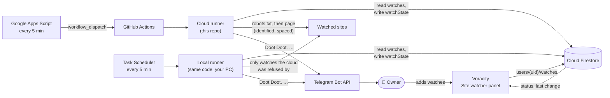

# voracity-watcher

The scheduled runner behind [Voracity](https://voracity.web.app)'s **Site watcher**
and **Ica**, its Telegram assistant: page-change alerts, a morning briefing,
reminder alerts, and quick capture of reminders, notes and links by message.
Every five minutes, GitHub Actions checks the pages you have listed in Voracity.
When something changes, Ica, a Telegram bot, sends you a message:

```text
Doot Doot.
EX13 singles changed: 12 new, 2 changed.

New
• EX13-001 … 980 円 在庫 : 3 点
…
Changed
• EX13-005 … 880 円
   was: EX13-005 … 980 円

Open the page
```

The watch list lives in your private Firestore account, not in this repository.
This repository holds only generic code, so it can be public. That gives free,
unlimited Actions minutes, and no addresses or personal data are published.



## Being a good citizen

The runner is built so sites have no reason to block it:

- **robots.txt is always obeyed.** Before checking a page, the runner fetches the site's
  `robots.txt` once per run and follows it under [RFC 9309](https://www.rfc-editor.org/rfc/rfc9309):
  - Rules for the `VoracityWatcher` user agent take precedence over the `*` rules.
  - The longest matching rule wins.
  - If robots.txt returns a server error or can't be reached, nothing on that site is
    fetched until it can be read again.
- **Crawl-delay is respected.** Requests to one host go one at a time, at least 3 seconds
  apart, or the site's `Crawl-delay` if that's longer. A slow host gets fewer checks per
  run; the rest wait for the next run.
- **Honest identification.** Every request sends
  `User-Agent: VoracityWatcher/1.0.0 (+https://github.com/kevanwee/voracity-watcher)`, so
  site operators can see who is visiting and why.
- **Minimal requests.** One request fetches the page's HTML only: no images, scripts or
  stylesheets, and no cookies. Pages that send `ETag` or `Last-Modified` are re-requested
  conditionally, so an unchanged page costs almost nothing.
- **Backing off.** A `429` or `503` honours `Retry-After`. Other failures back off
  exponentially from the watch's interval, up to once a day. A `401`/`403` (refused)
  pauses checks and tells you, without hammering the site.
- **Bounded work.** At most 30 watches per owner, 5 per host per run, and a 4-minute run
  budget. Pages over 5 MB and requests over 20 seconds are abandoned.

Check each site's terms yourself as well. robots.txt says what automated access a site
allows; its terms may add more. Alerts are for your own use: don't republish content
you're notified about.

## Cloud first, then your PC

Some sites refuse every request from data-centre IP ranges, including GitHub
Actions, while accepting the same request from a home connection. Each watch
therefore has a route:

- **Automatic (default):** the cloud runner checks the watch. If the site
  answers `401`/`403` twice in a row, the watch moves to your PC **for good**,
  and Ica tells you. The cloud runner never contacts that site again: retrying
  a site that is refusing you is how IP bans start.
- **Only my PC:** chosen in Voracity for sites you already know block cloud
  servers. The cloud runner never requests it at all.

Each runner checks only the watches routed to it, so a page is never fetched
twice and alerts never duplicate. The local runner obeys exactly the same rules
(robots.txt, Crawl-delay, backoff). Refusals it sees are reported normally. It
only runs while your PC is on and awake. Voracity shows each runner's last
check-in and warns if your PC hasn't checked in.

### Install the local runner (Windows)

Use Node 24. From a clone of this repository:

```powershell
npm ci
powershell -ExecutionPolicy Bypass -File .\scripts\local\install.ps1 `
  -ServiceAccountPath "$HOME\Downloads\<key>.json" `
  -Owners '{"<notes UID>":"<Telegram chat ID>"}'
# prompts for the Telegram bot token
powershell -ExecutionPolicy Bypass -File .\scripts\local\run.ps1 -Test   # Ica: "connected from your PC"
```

This registers a **Voracity watcher** task. It starts a small listener when you
sign in, with no window, and relaunches it if it ever stops. The listener checks
your PC's watches every 5 minutes and answers Telegram commands.

- **Secrets:** stored in `%USERPROFILE%\.voracity-watcher\`, encrypted with
  Windows DPAPI (readable only by your Windows account), so you can delete the
  downloaded key afterwards.
- **Log:** `logs\watcher.log` in the same folder, counts only.
- **Changing the token:** `install.ps1 -UpdateToken`.
- **Removing everything:** `install.ps1 -Uninstall`.

## Ica's daily messages

The cloud runner sends these. It is always on, and for these messages it reads
Firestore only, never a website. Settings live in Voracity (Tech Tools → Site watcher →
Ica's daily messages) at `users/{uid}/settings/assistant`:

- **Morning briefing** (default 08:00 in your time zone): reminders due today, still
  open, and due tomorrow, plus watch changes since the last briefing and your unread
  reading list. It is sent once a day. If the runner was down at that time, it arrives
  late rather than never.
- **Reminder alerts:** reminders due today are covered by the morning message. One you
  add after the morning, due today, gets its own message within a run or two. Nothing
  repeats.
- With the briefing off, the morning message is sent only when something is due.

**Calendar:** connect Google Calendar read-only through its *secret address in iCal
format*. No OAuth token is stored anywhere. Events appear in the briefing and in
answers to questions:

1. In Google Calendar on the web, open **Settings → (your calendar) → Integrate calendar**
   and copy **Secret address in iCal format**. Anyone with this link can read that
   calendar, so treat it like a password; **Reset** there revokes it.
2. Add it as the `WATCHER_CALENDARS` Actions secret, as
   `{"<notes UID>": ["<secret address>"]}`. Several calendars per owner are allowed.
   For the PC listener, run
   `install.ps1 -Calendars '{"<notes UID>":["<secret address>"]}'`.

Repeating events, skipped and moved occurrences, all-day events and time zones are
handled (Mozilla's `ical.js`). Ica can read the calendar but can't add events to it.

## Quick capture

Message Ica and it proposes a card with **Save** and **Cancel** buttons. Nothing is
saved until you tap Save.

| Message | Becomes |
| --- | --- |
| `remind me to file the brief Friday` | Reminder "File the brief", due the coming Friday |
| `/remind renew licence 20/11` | Reminder due 20 November (dates are day-first) |
| `note: book the venue` (extra lines become the body) | Note in My Space |
| a link on its own, or `/save <link> [title]` | Reading-list item |

- **Understood dates:** today, tomorrow, weekdays (always the next one, never today),
  "in 3 days" or "in 2 weeks", `5 Oct`, `Oct 5`, `5/10` and `2026-10-05`.
- **Proposals expire** after 24 hours.
- **Saved items match the app:** cards and bookmarks are written exactly as Voracity
  writes them, so they sync to every device straight away.

**When your PC is off,** the cloud runner picks up waiting messages on its next run, so
capture, edits and `/status` still work from your phone. With the
[wake-up timer](#keep-ica-awake) that is within about 5 minutes. `/check` then reports
the watches GitHub just checked and names the PC watches that wait for it. Only
questions need the PC, because they use the AI on it.

## Changing things

Every change asks first (**Mark done / Update / Delete** or **Cancel**). Each write is
checked against the card's revision, so an edit made elsewhere in the meantime is
never overwritten; Ica tells you to send the request again instead.

| Message | What happens |
| --- | --- |
| `/done file the brief` | Mark a reminder done (it moves to Archive in Voracity) |
| `/move pay rent to Monday` (or `/due pay rent tomorrow`) | Change a reminder's due date |
| `/delete old idea` | Delete a card |
| ✓ buttons under the briefing and reminder alerts | One tap marks that reminder done |

If several cards match, Ica lists up to three to choose from.

## Questions

Anything that isn't a command or a capture goes to the AI on your PC: your Ollama
model from Voracity's Second Brain settings (default `qwen3:14b`), and only ever on
`localhost`.

- **What it can look up:** reminders (by day, week or date range), cards, the reading
  list, watches and the calendar.
- **What it can change:** nothing directly. It can only propose a change, which you
  confirm with a button.
- **Examples:** "what's due before my exam?", "what's on tomorrow?", "move pay rent to
  Monday", "mark the brief done".
- **Limits:** each question allows 4 model rounds, 8 tool calls and 3 minutes. Your
  open reminders and the next 14 days' dates are given to the model up front, so it
  never guesses dates.
- **Nothing leaves your PC,** and questions aren't logged.
- **When the PC is off,** Ica says so. There is no cloud AI fallback.

## Asking Ica to check

Message Ica on Telegram. These commands also appear in the bot's `/` menu:

| Command | What happens |
| --- | --- |
| `/check` | Checks every watch on your PC now. Changes arrive as normal alerts, followed by a summary per watch |
| `/check ex13` | Checks only watches whose name contains "ex13" |
| `/status` | Lists each watch, whether GitHub or your PC checks it, and its last check and change |
| `/help` | Lists the commands |

How commands are handled:

- **Owner only.** Ica answers only chats listed in `WATCHER_OWNERS` and ignores everyone else.
- **Same site rules.** A requested check still obeys robots.txt, Crawl-delay and any
  Retry-After or backoff. Each watch can be checked on request at most once a minute.
- **No overlap.** Scheduled and requested checks share one queue in one process, so they
  never overlap or double-alert.
- **PC watches only.** `/check` covers watches on your PC. GitHub watches keep their own
  schedule, and `/status` shows their last check.
- **Nothing runs late.** Commands sent while your PC was off aren't run when it comes
  back; Ica asks you to resend.

## What is compared

- **With a CSS selector** (for example `.card-product`), each matching element becomes
  one item. Buttons and form controls inside it are ignored. Items are compared as a set,
  and an item whose leading code (such as `BT26-050`) appears on both sides with
  different text is reported as *changed*.
- **Without a selector**, each visible line of the page's text is an item.
- **Ignore pattern** (optional): a regular expression removed from each item before
  comparing. For example, `在庫\s*:\s*\d+\s*点` stops stock counts from triggering alerts.

The first check, or the first check after you change a watch's address, selector or
ignore pattern, records a baseline and confirms it on Telegram. Sites that require a login
or build their content with JavaScript can't be watched.

### What an alert says

Alerts open with a one-line summary, then what matters:

```
Doot Doot.
Digimon EX13: 1 sold out, 1 price drop, 4 stock changes.

🔴 Sold out
• Alphamon (Parallel) · ¥2,480

💸 Price down
• Omnimon (Parallel): ¥3,480 → ¥2,980

📦 Stock: Jesmon (Parallel) 3→2 · Magnamon (Parallel) 8→7 · …

▸ Full list   (tap to expand: every entry, before → after, with the original name)
Open the page
```

- **Reading each line:** the alert finds the price (`円`, `¥`, `$`, `S$`) and the
  stock (`在庫 : 3 点`, `在庫 : ×`, "sold out", "3 left", "in stock") in every entry.
  - It sorts changes into sold out, back in stock, new, price down, price up, stock
    counts and anything else.
  - Lines it can't read still show in the full list as before → after.
- **The full list** sits in a collapsed quote that you tap to open, trimmed to fit
  Telegram's message limit.
- **Japanese names are translated to English on your PC**, for watches the local
  runner checks (such as yuyu-tei):
  - A built-in glossary covers common names exactly and instantly: the Digimon Royal
    Knights, Parallel, Special Edition and so on.
  - Anything else goes to the Ollama model you chose for Second Brain, on localhost
    only. Each name is translated once and remembered with the watch.
  - If the model isn't running, the alert goes out with the original names.
  - The cloud runner never translates, and nothing is sent to an outside service.
- **Ignore pattern:** you no longer need one to hide stock noise, since stock changes
  are summarised on a single line. Use one only if you don't want stock alerts at all.

## Setup

You need a Voracity notes account, a Telegram account, and access to the Voracity
Firebase project.

1. **Create Ica.** In Telegram, message [@BotFather](https://t.me/BotFather):
   - Send `/newbot`, set the name to `Ica`, and choose a username ending in `bot`.
     Keep the token private.
   - Send `/setuserpic` and upload Ica's picture.
   - Optionally, `/setdescription`.
2. **Find your chat ID.** Send Ica any message, then open
   `https://api.telegram.org/bot<token>/getUpdates` in your browser and copy
   `result[0].message.chat.id`.
3. **Create a least-privilege service account.** In Google Cloud console → IAM & Admin →
   Service accounts, for the Firebase project:
   - Create `voracity-watcher` with only the **Cloud Datastore User** role.
   - Under Keys, add a JSON key and download it.
4. **Add repository secrets** (Settings → Secrets and variables → Actions):

   | Secret | Value |
   | --- | --- |
   | `TELEGRAM_BOT_TOKEN` | The token from BotFather |
   | `FIREBASE_SERVICE_ACCOUNT` | The whole JSON key file |
   | `WATCHER_OWNERS` | `{"<notes account UID>": "<chat ID>"}`. Voracity's Site watcher setup shows this with your UID filled in |
| `TRACK17_API_KEY` | Optional: your 17TRACK API key, for [parcels](#parcels) |

   With the GitHub CLI, set them from files so they never appear in your shell history:

   ```bash
   gh secret set TELEGRAM_BOT_TOKEN   < token.txt
   gh secret set FIREBASE_SERVICE_ACCOUNT < service-account.json
   gh secret set WATCHER_OWNERS        < owners.json
   ```

   Delete the local key file afterwards.
5. **Test.** Actions → *Watch sites* → *Run workflow*, ticking *Send a test message*. Ica
   should reply "Doot Doot. Ica is connected to Voracity."
6. **Keep Ica awake** (strongly recommended): see below.

### Keep Ica awake

GitHub runs scheduled workflows in free repositories on a best-effort basis. In practice
this repository's "every 5 minutes" schedule ran only every 4 to 6 hours, so while the
PC was off Ica answered hours late and briefings arrived late. A run that is *requested*
starts within seconds, so a small Google Apps Script requests one every 5 minutes. It is
free and runs under your own Google account.

1. Create a **fine-grained token** at
   [github.com/settings/personal-access-tokens/new](https://github.com/settings/personal-access-tokens/new):
   - Repository access: *Only select repositories* → this repository.
   - Repository permissions: **Actions → Read and write**. Nothing else.
   - It can start or cancel this repository's workflows, but it can't read the secrets
     or change the code.
2. Open [script.google.com](https://script.google.com) → *New project*, and paste
   [`scripts/apps-script/wake.gs`](scripts/apps-script/wake.gs).
3. *Project Settings* → *Script properties* → add `GITHUB_TOKEN` with the token. If your
   fork has another name, also add `WATCHER_REPO` (`owner/name`).
4. Back in the editor, pick **install** and press *Run*, then allow the permissions it
   asks for (an external request, and running on a schedule).

Voracity's Ica badge turns active within 5 minutes. To stop, run **uninstall**, or delete
the token on GitHub. GitHub's own schedule stays on as a fallback.

The cost stays at zero:
- Each run takes about 20 seconds, and Actions minutes are free for public repositories.
- The script uses about 3 of Apps Script's 90 free minutes a day.
- With a few watches, each run reads about 13 Firestore documents and writes about 4:
  roughly 3,700 reads and 1,200 writes a day, against free limits of 50,000 and 20,000.

## Parcels

Track deliveries from Voracity's **Parcels** card, or send Ica
`track <number> <name>`. Examples: `track SPXSG012345678901 keyboard`, or `/track` with
the number and then the name.

- **Carrier detection is automatic.** [17TRACK](https://api.17track.net) recognises
  SingPost, Shopee Express, Ninja Van, J&T, Qxpress, DHL, UPS, FedEx and about 2,900
  others.
- **Each cloud run:**
  - registers new numbers once (the only step that uses 17TRACK quota);
  - reads the status of parcels due a check: every 30 minutes, or daily once
    delivered. Reading status is free;
  - saves the status to `parcelState/{id}` for Voracity to show.
- **Ica messages you once per change**, when the status or latest event changes:
  "📦 Now tracking …", "📦 Keyboard: out for delivery.", "📦 Keyboard was delivered ✓".
  - "Waiting for the carrier" with nothing to show stays quiet.
  - If Telegram is down, the change is reported on the next run.
- **The morning briefing** has a **Parcels** section for anything out for delivery,
  ready to collect, failed or due today.
- **`/parcels`** lists everything being tracked.
- **Stopping:** archive or delete a parcel in Voracity and the runner stops checking it.
  17TRACK stops by itself after 30 days without updates.

**Setup:** create a free account at [17TRACK's API](https://api.17track.net/en), copy
the API key from the dashboard, and add it as the `TRACK17_API_KEY` Actions secret:

```bash
gh secret set TRACK17_API_KEY < track17-key.txt
```

Until it's set, each parcel says Ica isn't set up yet.
- **Allowance:** new 17TRACK accounts get 200 free tracking numbers, once. Ica uses one
  per parcel, and a refused number (not found yet, or invalid) uses none. It's retried
  every 6 hours.
- **When it runs out,** existing parcels keep updating, and new ones say so.

## Data

The runner uses the Admin SDK, which bypasses Firestore security rules, and touches only
these paths for each owner listed in `WATCHER_OWNERS`:

| Path | Access | Contents |
| --- | --- | --- |
| `users/{uid}/watches/{id}` | read | Watch configuration written by Voracity |
| `users/{uid}/watchState/{id}` | write | Status shown in Voracity: last check, item count, last change, error, backoff |
| `users/{uid}/watchItems/{id}` | read/write | The previous item snapshot used for comparison; not readable by browsers |
| `users/{uid}/watcher/status` | write | Heartbeats (`cloudRunAt`, `localRunAt`), so Voracity can warn if a runner stops |
| `users/{uid}/settings/assistant` | read | Briefing, alerts, morning time, time zone (written by Voracity) |
| `users/{uid}/cards`, `bookmarks` | read; create on Save | Unfinished reminders and unread links for messages; new items only after you tap Save |
| `users/{uid}/assistant/schedule`, `inbox` | read/write | Which mornings and reminders were sent; unconfirmed proposals. Not readable by browsers |
| `users/{uid}/cards/{id}` | update / delete on confirm | Done, due date, title, or deletion, only if the revision is unchanged |
| `users/{uid}/settings/brain` | read (PC only) | Which local Ollama model answers questions |
| `users/{uid}/parcels/{id}` | read; create on Save | Parcels written by Voracity, or by Ica after you tap Save on a `track` proposal |
| `users/{uid}/parcelState/{id}` | write | Tracking status from 17TRACK: status, carrier, latest and recent events, estimate |

Alerts for an owner go only to that owner's chat. If Telegram is unreachable, the old
snapshot is kept, so the change is reported on a later run.

## Privacy of logs

Actions logs on a public repository can be read by anyone. The runner prints counts only:
never URLs, page content, owner IDs or chat IDs. Secrets are masked by GitHub. Error
messages are reduced to fixed text or error codes.

## Limits

- GitHub's own schedule is best-effort (it ran every 4–6 hours here). The Apps Script
  [wake-up timer](#keep-ica-awake) makes it every 5 minutes. If the timer stops, runs fall
  back to GitHub's schedule.
- Watches on your PC pause while it is off or asleep. Missed checks run when it wakes.
- A watch that moved to your PC stays there. To try the cloud again, delete it and add it again.
- GitHub disables schedules in public repositories after 60 days without commits. The
  workflow re-enables itself daily, and Voracity warns you if the runner hasn't checked in
  for 45 minutes.
- Firestore's free tier (50,000 reads and 20,000 writes per day) covers 30 watches
  checked every 5 minutes.

## Development

```bash
npm ci
npm test          # unit tests with a fake network, clock and store
npm run typecheck
```

Node 24 runs the TypeScript sources directly. To try a full run against the Firestore
emulator, set `FIRESTORE_EMULATOR_HOST`, `WATCHER_OWNERS`, `TELEGRAM_BOT_TOKEN` and
`TELEGRAM_API` (point it at a local mock server), then run `npm run watch`.

## License

MIT
